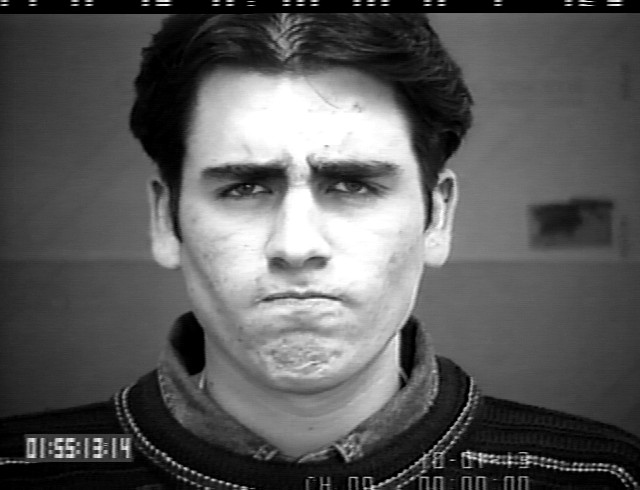
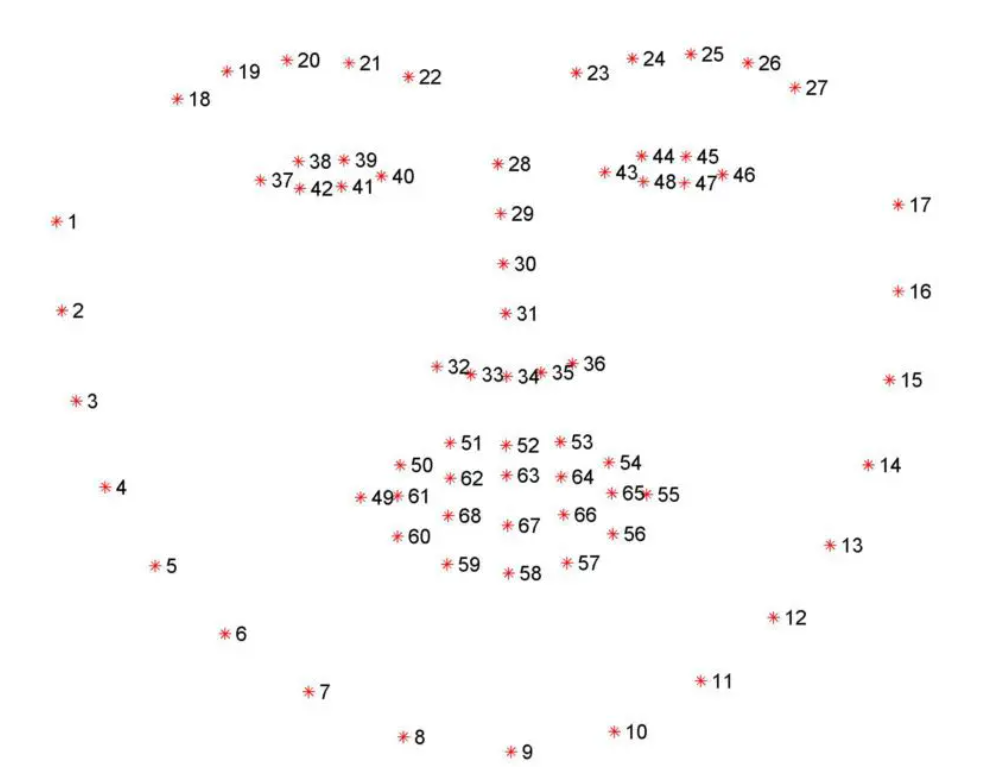
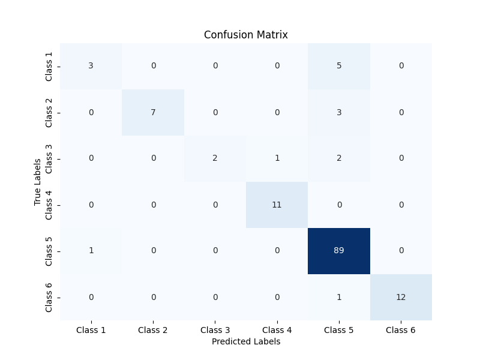

# Facial Emotion Detection using GAT #

This project will focus on emotion detection. The dataset used is from CK+.

sample image looks like this

-> We use dlib library to extract facial features. It looks something like this

-> Requirements.txt is provided. It is recommended to create a venv using this file.
-> Download CK+ dataset. This should then be stored in project root directory inside folder data. It will look something like this
root
└── data/
    ├── emotion/

## Overview ##
1. Hourglass Backbone (for image features):
Initial convolution layers process the grayscale image input.
Downsample and upsample layers, each with convolutional and transpose convolutional operations, allow the network to capture multi-scale image features.
The output of the hourglass block is pooled to form a fixed-length feature vector representing image features.

2. Graph Attention Network (GAT for landmark features):
Each landmark is treated as a node, with edges between landmarks defined in edge_index.
Two GAT layers process the landmark positions using multi-head attention to capture complex relationships between landmarks.
The output of the GAT is pooled to obtain a single graph feature vector.

3. Final Classifier:
The concatenated feature vector (image features + graph features) passes through a linear layer for classification, producing logits for each emotion class.

## How to Use - ##
1. Make sure your data follows the structure

data/
└── emotion/
    ├── train/
    ├── val/
    └── test/

2. Helper function "createDataSplit.py" is provided for doing this. You just need to provide the data path to it which contains images in this structure

data/
└── emotion/

3. use "train.py" to train the model. The checkpoint will be stored by the name of "best_model.pt". "final_model.pt" is the model of the last checkpoint trained. If model is interrupted during training, then "interrupted_mode.pt" is also stored.
4. The model accuracy can then be tested using "test.py"

## Details ##
Model architecture used is given below

Early stopping has been implemented to prevent overfitting. Also, oversampling technique is used to reduce bias due to class imbalance.

The loss function used is CrossEntropy loss

## Results ##
The F1 Score obtained is 0.90, and accuracy is 90.51%. Below is the confusion matrix for the same.
